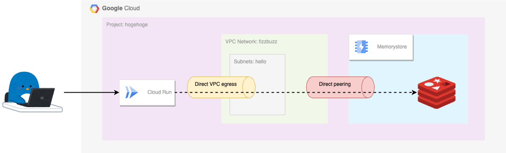

# Hands On Cloud Run to Memorystore for Redis

Cloud Run から Memorystore for Redis に繋げるハンズオンです

いくつかのパターンを用意しました :)

## 1. [同じプロジェクト内で Cloud Run から Memorystore にアクセスする](./single-project/)

### 1-1. Direct peering

### 1-2. Private service access

## 2. [違うプロジェクトの Cloud Run から Memorystore にアクセスする](./different-projects/)

