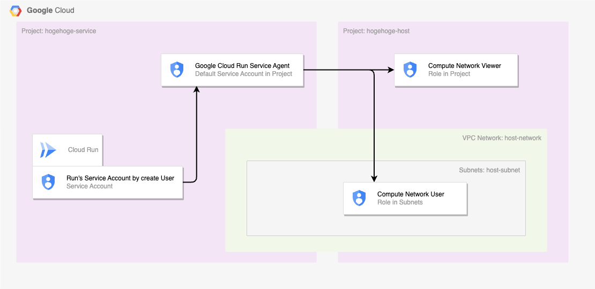

# 違うプロジェクトの Cloud Run から Memorystore にアクセスする

## 概要

以下を構築していきます

[公式ドキュメント | Direct VPC egress with a Shared VPC network](https://cloud.google.com/run/docs/configuring/shared-vpc-direct-vpc?hl=en)


## 0. 準備

+ 環境変数をセット

```
export _gc_pj_id_host='hogehoge-host'
export _gc_pj_id_service='hogehoge-service'

### Different Projects cloudRun memorystoreforRedis Shared VPC
export _common='dprrshared'

export _region='asia-northeast1'
export _sub_network_range='10.146.0.0/20'
```

+ API の有効化

```
### ホストプロジェクトにて
gcloud beta services enable compute.googleapis.com           --project ${_gc_pj_id_01}
gcloud beta services enable redis.googleapis.com             --project ${_gc_pj_id_01}
gcloud beta services enable servicenetworking.googleapis.com --project ${_gc_pj_id_01}
```

```
### サービスプロジェクトにて
gcloud beta services enable compute.googleapis.com          --project ${_gc_pj_id_02}
gcloud beta services enable artifactregistry.googleapis.com --project ${_gc_pj_id_02}
```

+ 組織レベルで必要な Role
  + [公式ドキュメント | Provision Shared VPC](https://cloud.google.com/vpc/docs/provisioning-shared-vpc?hl=en)

```
この作業者は組織レベルで以下の Role を持っている必要があるので付与
Compute Shared VPC Admin (compute.organizations.enableXpnHost)
```

+ Google Cloud 組織の ID を取得

```
export _gc_org_id='xxxyyyzzz'
```


## 1. ホストプロジェクトでやること


### 1-1. 共有 VPC のホストプロジェクトとして有効化

+ 共有 VPC のホストプロジェクトにする Google Cloud のプロジェクトに対して、共有 VPC を有効化

```
gcloud beta compute shared-vpc enable ${_gc_pj_id_host}
```

+ 共有 VPC の設定の確認

```
gcloud beta compute shared-vpc organizations list-host-projects ${_gc_org_id} --filter=${_gc_pj_id_host}
```
```
### 例
$ gcloud beta compute shared-vpc organizations list-host-projects ${_gc_org_id} --filter=${_gc_pj_id_host}
NAME                        CREATION_TIMESTAMP  XPN_PROJECT_STATUS
hogehoge-host
```

+ 共有 VPC のホストプロジェクトにサービスプロジェクトを接続

```
gcloud beta compute shared-vpc associated-projects add ${_gc_pj_id_service} \
  --host-project ${_gc_pj_id_host}
```

+ サービスプロジェクトの紐付けの確認

```
gcloud beta compute shared-vpc list-associated-resources ${_gc_pj_id_host}
```
```
### 例

$ gcloud beta compute shared-vpc list-associated-resources ${_gc_pj_id_host}
RESOURCE_ID                 RESOURCE_TYPE
hogehoge-service            PROJECT
```

## 1-2. ネットワークの作成

+ VPC Network の作成

```
gcloud beta compute networks create ${_common}-network \
  --subnet-mode custom \
  --project ${_gc_pj_id_host}
```

+ Private Services Access の設定
  + Memorystore 用

```
gcloud beta compute addresses create ${_common}-psa \
  --global \
  --network ${_common}-network \
  --purpose VPC_PEERING \
  --prefix-length 16 \
  --project ${_gc_pj_id_host}
```

+ Private Connection の作成
  + Memorystore 用

```
gcloud beta services vpc-peerings connect \
  --network ${_common}-network \
  --ranges ${_common}-psa \
  --service servicenetworking.googleapis.com \
  --project ${_gc_pj_id_host}
```

+ サブネットの作成
  + Cloud Run の Direct VPC egress 用

```
gcloud beta compute networks subnets create ${_common}-subnets \
  --network ${_common}-network \
  --region ${_region} \
  --range ${_sub_network_range} \
  --enable-private-ip-google-access \
  --project ${_gc_pj_id_host}
```

### 1-3. Memorystore for Redis の作成

+ 環境変数を設定

```
export _instance_tier='basic'
export _instance_num='1'
export _redis_ver='redis_7_0'

### Private services access の場合
export _connect_mode='PRIVATE_SERVICE_ACCESS'
```

+ Memorystore for Redis のインスタンスの作成

```
gcloud beta redis instances create ${_common}-redis \
  --tier ${_instance_tier} \
  --size ${_instance_num} \
  --redis-version ${_redis_ver} \
  --region ${_region} \
  --connect-mode ${_connect_mode} \
  --network=projects/${_gc_pj_id_host}/global/networks/${_common}-network \
  --reserved-ip-range ${_common}-psa \
  --project ${_gc_pj_id_host} \
  --async
```

ちょっと待ちます :coffee:

+ Memorystore for Redis のインスタンスのエンドポイントを確認
  + Cloud Run デプロイ時に使用

```
gcloud beta redis instances describe ${_common}-redis \
  --region ${_region} \
  --project ${_gc_pj_id_host} \
  --format json | jq -r .host
```

+ Memorystore for Redis のインスタンスのエンドポイントを環境変数に設定

```
export _redis_host=$(gcloud beta redis instances describe ${_common}-redis \
  --region ${_region} \
  --project ${_gc_pj_id_host} \
  --format json | jq -r .host)
export _redis_port=$(gcloud beta redis instances describe ${_common}-redis \
  --region ${_region} \
  --project ${_gc_pj_id_host} \
  --format json | jq -r .port)


### 確認
echo Redis IP Address: ${_redis_host}
echo Redis IP Port: ${_redis_port}
```
```
### 例

$ echo Redis IP Address: ${_redis_host}
echo Redis IP Port: ${_redis_port}
Redis IP Address: 10.11.0.3
Redis IP Port: 6379
```

+ Memorystore for Redis の接続ページ


## 2. サービスプロジェクトでの設定


### 2-1. IAM

+ Cloud Run 用の Service Account を発行

```
gcloud beta iam service-accounts create ${_common}-run-sa \
  --description="${_common} の Cloud Run 用のサービスアカウント" \
  --display-name="${_common}-run-sa" \
  --project ${_gc_pj_id_service}
```

+ サービスプロジェクトの Project Number を取得

```
export _gc_pj_num_service=`gcloud beta projects describe ${_gc_pj_id_service} --format json | jq -r .projectNumber`

echo ${_gc_pj_num_service}
```
```
### 例 (適当です)

1070761883354
```

+ サービスプロジェクトの Google Cloud Run Service Agent の Service Account に、ホストプロジェクト内の Role を付与
  + **service-${Project Number}@serverless-robot-prod.iam.gserviceaccount.com** の形の Service Account
  + 詳しくは公式ドキュメント [Set up IAM permissions](https://cloud.google.com/run/docs/configuring/shared-vpc-direct-vpc?hl=en#set_up_iam_permissions) を参照

```
### compute.networkViewer in Host Project
gcloud beta projects add-iam-policy-binding ${_gc_pj_id_host} \
  --member "serviceAccount:service-${_gc_pj_num_service}@serverless-robot-prod.iam.gserviceaccount.com" \
  --role "roles/compute.networkViewer"

### compute.networkUser on Subnets in Host Project
gcloud beta compute networks subnets add-iam-policy-binding ${_common}-subnets \
  --region ${_region} \
  --member "serviceAccount:service-${_gc_pj_num_service}@serverless-robot-prod.iam.gserviceaccount.com" \
  --role "roles/compute.networkUser" \
  --project ${_gc_pj_id_host}
```

+ サービスプロジェクト内の Cloud Run 用の Service Account が、同じプロジェクト内の Google Cloud Run Service Agent の Role を付与
  + Cloud Run Service Agent (roles/run.serviceAgent)

```
gcloud beta projects add-iam-policy-binding ${_gc_pj_id_service} \
  --member "serviceAccount:${_common}-run-sa@${_gc_pj_id_service}.iam.gserviceaccount.com" \
  --role "roles/run.serviceAgent"
```

### 2-2. ネットワークの作成

ここは特に無し

### 2-3. Artifact Registry のリポジトリ作成とコンテナイメージの格納

+ Artifact Registry のリポジトリを作成

```
gcloud beta artifacts repositories create ${_common}-ar \
  --repository-format docker \
  --location ${_region} \
  --project ${_gc_pj_id_service}
```

+ Cloud Run にデプロイするコンテナイメージの作成とアップロード

```
git clone https://github.com/joeferner/redis-commander.git
cd redis-commander

docker build -f Dockerfile . --tag=${_region}-docker.pkg.dev/${_gc_pj_id_service}/${_common}-ar/redis-commander:latest
docker push ${_region}-docker.pkg.dev/${_gc_pj_id_service}/${_common}-ar/redis-commander:latest
```

### 2-5. Cloud Run のサービスのデプロイ

+ Cloud Run のサービスのデプロイ
  + [Deploy a service](https://cloud.google.com/run/docs/configuring/shared-vpc-direct-vpc?hl=en#deploy-service)

```
gcloud beta run deploy ${_common}-run \
  --platform managed \
  --network projects/${_gc_pj_id_host}/global/networks/${_common}-network \
  --subnet projects/${_gc_pj_id_host}/regions/${_region}/subnetworks/${_common}-subnets \
  --region ${_region} \
  --cpu 1000m \
  --memory 512Mi \
  --image ${_region}-docker.pkg.dev/${_gc_pj_id_service}/${_common}-ar/redis-commander:latest \
  --port 8081 \
  --set-env-vars=REDIS_HOSTS=${_redis_host}, \
  --ingress all \
  --vpc-egress private-ranges-only \
  --allow-unauthenticated \
  --min-instances 1 \
  --max-instances 1 \
  --service-account ${_common}-run-sa@${_gc_pj_id_service}.iam.gserviceaccount.com \
  --project ${_gc_pj_id_service} \
  --quiet
```

+ Cloud Run のサービスの確認

```
gcloud beta run services describe ${_common}-run \
  --region ${_region} \
  --project ${_gc_pj_id} \
  --format json
```

## 6. Web ブラウザで確認

+ Top ページ



## 99. クリーンアップ

<details>
<summary>99-1. Cloud Run のサービスの削除</summary>

```
gcloud beta run services delete ${_common}-run \
  --region ${_region} \
  --project ${_gc_pj_id_service}
```

</details>

<details>
<summary>99-2. Artifact Registry の削除</summary>

```
gcloud beta artifacts repositories delete ${_common}-ar \
  --location ${_region} \
  --project ${_gc_pj_id_service}
```

</details>

<details>
<summary>99-3. Memorystore for Redis のインスタンスの削除</summary>

```
gcloud beta redis instances delete ${_common}-redis \
  --region ${_region} \
  --project ${_gc_pj_id_host} \
  --async
```

</details>

<details>
<summary>99-4. Service Account から Role を剥奪</summary>

```
gcloud beta projects remove-iam-policy-binding ${_gc_pj_id_service} \
  --member "serviceAccount:${_common}-run-sa@${_gc_pj_id_service}.iam.gserviceaccount.com" \
  --role "roles/run.serviceAgent"
```

</details>

<details>
<summary>99-4. Google Cloud Run Service Agent の Service Account から Role を剥奪</summary>

```
### compute.networkUser on Subnets
gcloud beta compute networks subnets remove-iam-policy-binding ${_common}-subnets \
  --region ${_region} \
  --member "serviceAccount:service-${_gc_pj_num_service}@serverless-robot-prod.iam.gserviceaccount.com" \
  --role "roles/compute.networkUser" \
  --project ${_gc_pj_id_host}

### compute.networkViewer on Project
gcloud beta projects remove-iam-policy-binding ${_gc_pj_id_host} \
  --member "serviceAccount:service-${_gc_pj_num_service}@serverless-robot-prod.iam.gserviceaccount.com" \
  --role "roles/compute.networkViewer"
```

</details>

<details>
<summary>99-4. Cloud Run 用の Service Account を削除</summary>

```
gcloud beta iam service-accounts delete ${_common}-run-sa@${_gc_pj_id_service}.iam.gserviceaccount.com \
  --project ${_gc_pj_id_service}
```

</details>

※ ここでしばらく待つ (15 分くらい)

<details>
<summary>99-4. Private Connection の削除</summary>

```
gcloud beta services vpc-peerings delete \
  --network ${_common}-network \
  --service servicenetworking.googleapis.com \
  --project ${_gc_pj_id_host}
```

</details>

<details>
<summary>99-5. Private Services Access の削除</summary>

```
gcloud beta compute addresses delete ${_common}-psa \
  --global \
  --project ${_gc_pj_id_host}
```

</details>

※ ここでしばらく待つ (1~2 時間くらい)

<details>
<summary>99-6. 共有 VPC のホストプロジェクトに接続しているサービスプロジェクトを解除</summary>

```
gcloud beta compute shared-vpc associated-projects remove ${_gc_pj_id_service} \
  --host-project ${_gc_pj_id_host}
```

</details>

<details>
<summary>99-7. サブネットの削除</summary>

```
gcloud beta compute networks subnets delete ${_common}-subnets \
  --region ${_region} \
  --project ${_gc_pj_id_host}
```

</details>

<details>
<summary>99-8. VPC Network の削除</summary>

```
gcloud beta compute networks delete ${_common}-network \
  --project ${_gc_pj_id_host}
```

</details>

<details>
<summary>99-9. Cloud Run 用の Service Account の削除</summary>

+ WIP なぜかエラーになるので調査する

```
gcloud beta iam service-accounts delete ${_common}-run-sa@${_gc_pj_id_service}.iam.gserviceaccount.com \
  --project ${_gc_pj_id_service}
```

</details>

## 結び

Have Fan!! :)

