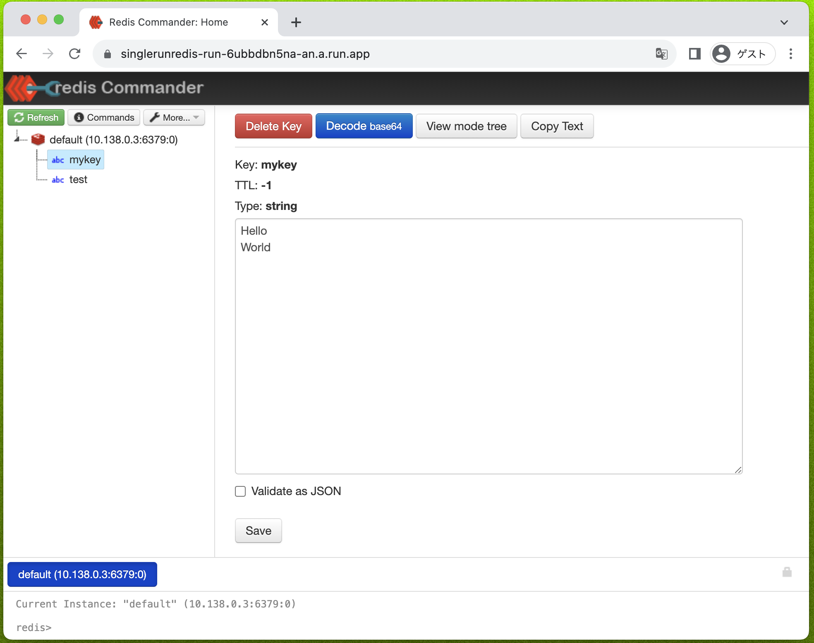
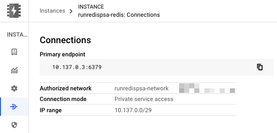

# 同じプロジェクト内で Cloud Run から Memorystore にアクセスする by using Private service access

## 概要


## 0. 準備

+ 環境変数をセット

```
export _gc_pj_id='Your Google Cloud ID'

### Cloud Run to Memorystore for Redis with Private service access in Single Project
export _common='runredispsa'

export _sub_network_range='10.146.0.0/20'
export _region='asia-northeast1'
```

## 1. IAM

+ Cloud Run 用の Service Account を発行し、 Cloud SQL に接続できる最低限の Role を付与

```
gcloud beta iam service-accounts create ${_common}-run-sa \
  --description="Cloud Run 用のサービスアカウント" \
  --display-name="${_common}-run-sa" \
  --project ${_gc_pj_id}
```

+ 上記で作成した Service Account に以下の Role を付与
  + 今回は不要

```
# 不要
```

## 2. ネットワークの作成

+ VPC Network の作成

```
gcloud beta compute networks create ${_common}-network \
  --subnet-mode=custom \
  --project ${_gc_pj_id}
```

+ Private service access の設定
  + Memorystore 用

```
gcloud beta compute addresses create ${_common}-psa \
  --global \
  --network ${_common}-network \
  --purpose VPC_PEERING \
  --prefix-length 16 \
  --project ${_gc_pj_id}
```

+ Private Connection の作成
  + Memorystore 用

```
gcloud beta services vpc-peerings connect \
  --network ${_common}-network \
  --ranges ${_common}-psa \
  --service servicenetworking.googleapis.com \
  --project ${_gc_pj_id}
```

+ サブネットの作成
  + Cloud Run の Direct VPC egress 用

```
gcloud beta compute networks subnets create ${_common}-subnets \
  --network ${_common}-network \
  --region ${_region} \
  --range ${_sub_network_range} \
  --enable-private-ip-google-access \
  --project ${_gc_pj_id}
```

## 3. Memorystore for Redis の作成

+ 環境変数を設定

```
export _instance_tier='basic'
export _instance_num='1'
export _redis_ver='redis_7_0'

# Private services access の場合
export _connect_mode='PRIVATE_SERVICE_ACCESS'
```

+ Memorystore for Redis のインスタンスの作成

```
gcloud beta redis instances create ${_common}-redis \
  --tier ${_instance_tier} \
  --size ${_instance_num} \
  --redis-version ${_redis_ver} \
  --region ${_region} \
  --connect-mode ${_connect_mode} \
  --network=projects/${_gc_pj_id}/global/networks/${_common}-network \
  --reserved-ip-range ${_common}-psa \
  --project ${_gc_pj_id} \
  --async
```

ちょっと待ちます :coffee:

+ Memorystore for Redis のインスタンスのエンドポイントを確認
  + Cloud Run デプロイ時に使用

```
gcloud beta redis instances describe ${_common}-redis \
  --region ${_region} \
  --project ${_gc_pj_id} \
  --format json | jq -r .host
```

+ Memorystore for Redis のインスタンスのエンドポイントを環境変数に設定

```
export _redis_host=$(gcloud beta redis instances describe ${_common}-redis \
  --region ${_region} \
  --project ${_gc_pj_id} \
  --format json | jq -r .host)


### 確認
echo ${_redis_host}
```
```
### 例

$ echo ${_redis_host}
10.137.0.3
```

## 4. Artifact Registry のリポジトリ作成とコンテナイメージの格納

+ Artifact Registry のリポジトリを作成

```
gcloud beta artifacts repositories create ${_common}-ar \
  --repository-format docker \
  --location ${_region} \
  --project ${_gc_pj_id}
```

+ Cloud Run にデプロイするコンテナイメージの作成とアップロード

```
git clone https://github.com/joeferner/redis-commander.git
cd redis-commander

docker build -f Dockerfile . --tag=${_region}-docker.pkg.dev/${_gc_pj_id}/${_common}-ar/redis-commander:latest
docker push ${_region}-docker.pkg.dev/${_gc_pj_id}/${_common}-ar/redis-commander:latest
```

## 5. Cloud Run のサービスのデプロイ

+ Cloud Run のサービスのデプロイ

```
gcloud beta run deploy ${_common}-run \
  --platform managed \
  --network ${_common}-network \
  --subnet ${_common}-subnets \
  --region ${_region} \
  --cpu 1000m \
  --memory 512Mi \
  --image ${_region}-docker.pkg.dev/${_gc_pj_id}/${_common}-ar/redis-commander:latest \
  --port 8081 \
  --set-env-vars=REDIS_HOSTS=${_redis_host}, \
  --ingress all \
  --vpc-egress private-ranges-only \
  --allow-unauthenticated \
  --min-instances 1 \
  --max-instances 1 \
  --service-account ${_common}-run-sa@${_gc_pj_id}.iam.gserviceaccount.com \
  --project ${_gc_pj_id} \
  --quiet
```

+ Cloud Run のサービスの確認

```
gcloud beta run services describe ${_common}-run \
  --region ${_region} \
  --project ${_gc_pj_id} \
  --format json
```

## 6. Web ブラウザで確認する

+ Top ページ



+ Memorystore for Redis の接続ページ



## 99. クリーンアップ

<details>
<summary>99-1. Cloud Run のサービスの削除</summary>

```
gcloud beta run services delete ${_common}-run \
  --region ${_region} \
  --project ${_gc_pj_id}
```

</details>

<details>
<summary>99-2. Artifact Registry の削除</summary>

```
gcloud beta artifacts repositories delete ${_common}-ar \
  --location ${_region} \
  --project ${_gc_pj_id}
```

</details>

<details>
<summary>99-3. Memorystore for Redis のインスタンスの削除</summary>

```
gcloud beta redis instances delete ${_common}-redis \
  --region ${_region} \
  --project ${_gc_pj_id} \
  --async
```

</details>

<details>
<summary>99-4. Private Connection の削除</summary>

```
gcloud beta services vpc-peerings delete \
  --network ${_common}-network \
  --service servicenetworking.googleapis.com \
  --project ${_gc_pj_id}
```

</details>

<details>
<summary>99-5. Private Services Access の削除</summary>

```
gcloud beta compute addresses delete ${_common}-psa \
  --global \
  --project ${_gc_pj_id}
```

</details>

※ ここでしばらく待つ (1時間くらい)

<details>
<summary>99-6. サブネットの削除</summary>

```
gcloud beta compute networks subnets delete ${_common}-subnets \
  --region ${_region} \
  --project ${_gc_pj_id}
```

</details>

<details>
<summary>99-7. VPC Network の削除</summary>

```
gcloud beta compute networks delete ${_common}-network \
  --project ${_gc_pj_id}
```

</details>

<details>
<summary>99-8. Cloud Run 用の Service Account の削除</summary>

```
gcloud beta iam service-accounts delete ${_common}-run-sa@${_gc_pj_id}.iam.gserviceaccount.com \
  --project ${_gc_pj_id}
```

</details>

## 結び

Have Fan!! :)
